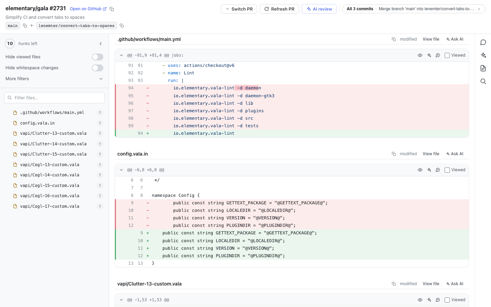

# mergie

**Review GitHub pull requests from a fast local web UI, driven by a small CLI.**

`mergie` clones a PR locally and serves a focused review interface in your browser — built for
reading diffs carefully, tracking what you've seen, leaving comments that post back to GitHub, and
(optionally) getting an AI review. It runs entirely on your machine and reuses your existing `gh`
login.



## Why

GitHub's web review is fine for small PRs, but it forgets what you've read, makes incremental
review (just the new commits since last time) awkward, and can't help you navigate a large diff.
`mergie` is built around those gaps:

- **Incremental review by commit range** — review only the commits added since you last looked,
  instead of re-reading the whole PR.
- **Progress you can trust** — mark hunks viewed; a ring shows how many are left, and viewed
  state persists across sessions and refreshes.
- **Comments that round-trip** — draft locally, then post, edit, or delete on GitHub; inbound
  review threads are synced in.
- **AI review & chat (optional)** — get an AI pass over a range, or ask questions about a hunk or
  file, powered by the Claude Agent SDK.
- **Made for big diffs** — a **flat or folder-tree** file list, fuzzy file search (that narrows the
  list without touching the diff), symbol/code search across the PR, word-level diff highlighting,
  and filters to hide viewed, lock/generated, or whitespace-only changes.

## Requirements

- **[Bun](https://bun.sh)** ≥ 1.2 (mergie's runtime).
- **git** and the **[GitHub CLI](https://cli.github.com) (`gh`)**, authenticated
  (`gh auth login`). mergie reuses `gh`'s token for **both** API access and cloning — it clones over
  HTTPS via gh's credential helper, so **no SSH key or host-key setup is needed**.
- *(Optional, for code search)* **[ripgrep](https://github.com/BurntSushi/ripgrep) (`rg`)** backs
  the search rail's **General** text/regex search, and **[`sem`](https://ataraxy-labs.github.io/sem/)**
  (`brew install sem-cli`) backs **Symbol** definition/usages lookups. mergie runs fine without
  them — only those two search features are unavailable.
- *(Optional, for AI features)* Claude access for the Claude Agent SDK — e.g. an
  `ANTHROPIC_API_KEY` in your environment.

mergie **checks these at startup**: it stops with install guidance if Bun or `gh` is missing (or
`gh` isn't signed in), and prints a one-line warning for each missing optional tool (`rg`, `sem`,
`claude`) naming the feature it disables. If you install via a non-Bun package manager (npm/pnpm)
on a machine without Bun, you get a clear "install Bun" message rather than a cryptic error.

## Install

```sh
bun install -g mergie-cli
# or run without installing:
bunx mergie-cli --pr https://github.com/withastro/astro/pull/17360
```

After a global install the command is simply `mergie`.

## Usage

```sh
mergie                                                  # open the home picker (no PR selected)
mergie --pr https://github.com/withastro/astro/pull/17360   # open a specific PR
mergie --no-open                                        # start/attach but don't open a browser tab
mergie reload                                           # restart the daemon (pick up UI changes)
mergie status                                           # is it running? which PRs are loaded?
mergie stop                                             # stop the daemon
mergie help                                             # full usage (also -h / --help)
mergie help stop                                        # help for one command
mergie version                                          # installed version (also -v / --version)
```

The URL is parsed tolerantly — trailing `/files`, `/changes`, `#…` are ignored. The first call
starts a small background daemon that serves the web UI; later calls attach to it. One daemon
serves **multiple PRs at once**, switchable inside the UI.

## How it works

- For each PR, mergie keeps **one reusable local clone** containing both branches, and fetches it
  (via the **Refresh PR** action) to pick up new commits.
- Durable state — viewed hunks, comments, reviewed ranges, AI results, chat sessions — lives in a
  per-PR **SQLite** database under your data directory, so everything is restored when you reopen a
  PR.

## Configuration

- **Data & state:** `$XDG_DATA_HOME/mergie/` (falling back to `~/.local/share/mergie/` when
  `XDG_DATA_HOME` is unset). mergie creates this directory automatically.
- **Config (optional):** mergie runs on built-in defaults and **creates no config file**. To
  override them, create `$XDG_CONFIG_HOME/mergie/config.toml` yourself (falling back to
  `~/.config/mergie/config.toml` when `XDG_CONFIG_HOME` is unset). It can set `lockfilePatterns` (which **extend** the built-in lock/generated globs),
  `models` (the selectable Claude model list), `templates` (AI-review prompts), and
  `largeDiffThreshold` (when a hunk collapses behind "Load diff") — `models`/`templates`
  **replace** the defaults when present. An absent or empty config dir is normal.
- **Port:** the daemon binds **4517**; set `MERGIE_PORT` to change it. Combined with
  `XDG_DATA_HOME`, this lets a second, isolated instance run alongside the first.

### `config.toml` format

Every section is optional — include only what you want to change. Unknown keys are ignored. Run
`mergie reload` (or reopen the PR) to apply edits.

```toml
# Extra lock/generated globs. ADDED on top of the built-in set (package-lock.json,
# yarn.lock, *.min.js, …), so listing these does not disable the defaults.
lockfilePatterns = ["*.generated.ts", "src/api/schema.ts"]

# A hunk with at least this many changed lines (additions + deletions) is hidden
# behind a "Load diff" button until you ask for it. Default 500; set 0 to disable.
largeDiffThreshold = 500

# Selectable Claude models. REPLACES the default list, so include every model you want.
#   id    — passed to the Claude Agent SDK (required)
#   label — text shown in the picker (optional; defaults to id)
[[models]]
id = "claude-opus-4-8"
label = "Opus 4.8"

[[models]]
id = "claude-sonnet-4-6"
label = "Sonnet 4.6"

# AI-review prompt templates. REPLACES the defaults ("Key decisions", "Adversarial bug pass").
# Each entry needs all three fields.
[[templates]]
id = "security"
title = "Security pass"
prompt = "Review the diff for security issues and unsafe patterns."
```

## Development

```sh
git clone https://github.com/ayushpoddar/mergie.git
cd mergie
bun install
bun test          # run the test suite
bun run typecheck # tsc --noEmit
bun run start     # run from source
```

## License

[GPL-3.0-or-later](LICENSE). © Ayush Poddar.
